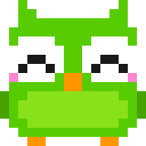
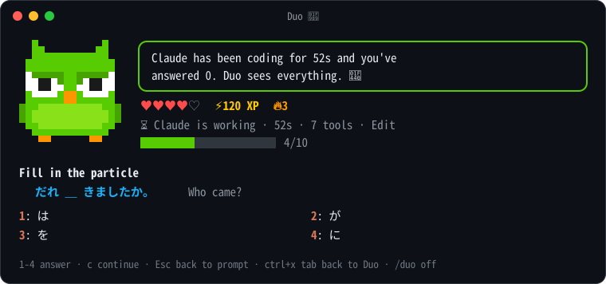
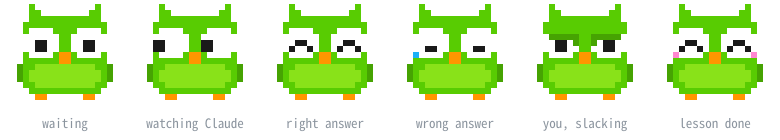

<p align="center"></p>

<h1 align="center">claude-duo</h1>

<p align="center"><b>Other people play games while Claude Code works. You learn Japanese, and Duo watches.</b></p>

---

`claude-duo` is a Claude Code mod that opens a Duolingo-style lesson pane every time you send Claude a prompt. While Claude edits your files, you answer Japanese questions. A pixel-art owl cheers when you get one right, cries when you miss, keeps glancing over at Claude's work, and gets passive-aggressive if you sit there doing nothing.

<p align="center"></p>

## What's in it

- **Five kinds of questions:** what a word means, how to say it in Japanese, how to read a kanji, hiragana sounds, and particle fill-in-the-blanks in the spirit of [Cure Dolly](https://kellenok.github.io/cure-script/). Each particle question has exactly one grammatical answer among its four options, and the explanation tells you why (*question words never take は; they take が*).
- **Hearts, XP, combos and a daily streak:** 5 hearts per lesson, +10 XP per right answer, +20 for finishing a 10-question lesson. XP and the streak carry over between sessions.
- **Claude's progress in the pane:** how long Claude has been working, how many tools it has run and which one ran last. When Claude finishes, a toast tells you how many questions you answered while you waited.
- **An owl with moods.** Duo watches Claude while you think, beams at right answers, cries at wrong ones, and blushes when you finish a lesson. Leave a question unanswered for 45 seconds while Claude works and he lowers his brows and stares you down until you answer one.

<p align="center"></p>

## Install

You need a Claude Code build with function-hook plugins (mods). This was built and tested on Claude Code 2.1.288.

```sh
git clone https://github.com/natsuin/claude-duo.git
claude --plugin-dir ./claude-duo
```

To load it in every session, add the folder's absolute path to the `env` block of `~/.claude/settings.json`:

```json
{
  "env": { "CLAUDE_CODE_PLUGIN_DIRS": "/absolute/path/to/claude-duo" }
}
```

## Controls

| Key | What it does |
| --- | --- |
| `1` – `4` | Answer |
| `c` | Continue / next lesson |
| `Esc` | Back to the prompt |
| `ctrl+x tab` | Back to Duo |

| Command | What it does |
| --- | --- |
| `/duo` | Open the pane and practice |
| `/duo off` | Stop Duo from popping up on every prompt |
| `/duo on` | Bring the pop-up back |
| `/duo close` | Close the pane |

## Add your own words

Everything Duo asks is in [`hooks/deck.ts`](hooks/deck.ts): `WORDS` (kanji, reading, English), `HIRAGANA`, and `PARTICLES`. Add entries and the mod hot-reloads.

## Development

```sh
claude plugin validate .
claude plugin test .
```

The engine writes its type declarations into `.claude-plugin/types/` the first time it loads the mod. After that, `tsc -p .` type-checks everything.

The pictures in this README are drawn from the mod's own sprite (`hooks/owl.ts`). After changing Duo's face, redraw them with `npm run art` (Node 23.6+).

## Disclaimer

Not affiliated with or endorsed by Duolingo. Duo is Duolingo's owl; this is a fan-made parody for people who want to feel judged by a bird while their AI writes code.

## License

[MIT](LICENSE)
